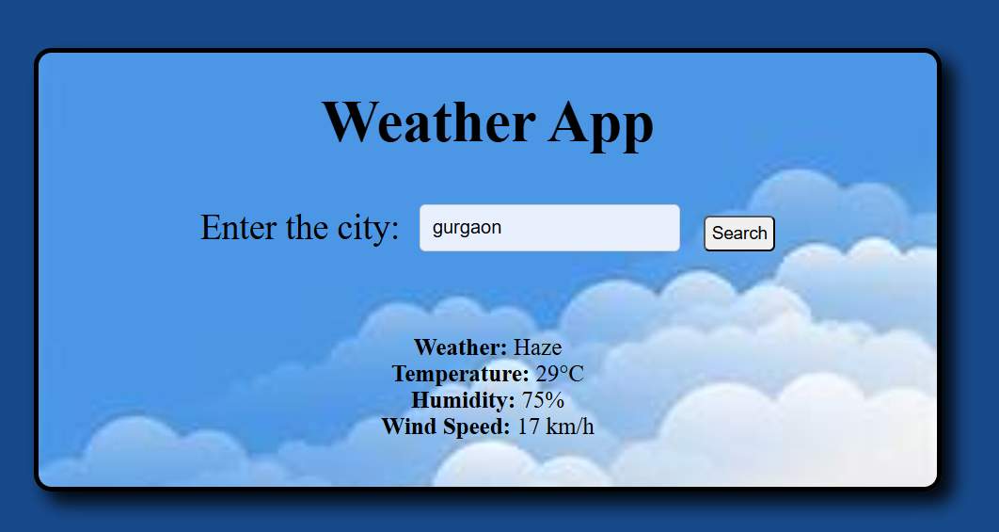

# 🌦️ Weather App

A simple and elegant **Weather App** built using **HTML**, **CSS**, and **JavaScript** that fetches real-time weather data using the **OpenWeatherMap API**. Just enter your city name to get current temperature, weather condition, humidity, and wind speed!

---


## 📸 Screenshot

<div align="center">
  
</div>

---

## 💡 Features

- 🌤️ Real-time weather updates
- 📍 Search by city name
- 🌡️ Shows temperature, humidity, wind speed
- 🎨 Clean and responsive UI

---

## 🛠️ Tech Stack

| HTML | CSS | JavaScript | API |
|------|-----|------------|-----|
| ✅   | ✅  | ✅         | 🌐 OpenWeatherMap |

---

## 📦 How to Use

1. **Clone the repo**

   ```bash
   git clone https://github.com/anuj-singal/weather-app.git
   ```
2. Navigate to the project folder
3. Open index.html in your browser
   ⚠️ Make sure you have an internet connection to fetch API data.

---

## 🧑‍💻 Author

<div> <a href="https://github.com/anuj-singal" target="_blank">  </a> </div>

---


## 💬 Feedback
Feel free to open issues or submit pull requests if you'd like to contribute or suggest improvements!

---


## ⚖️ License
This project is licensed under the MIT License.


